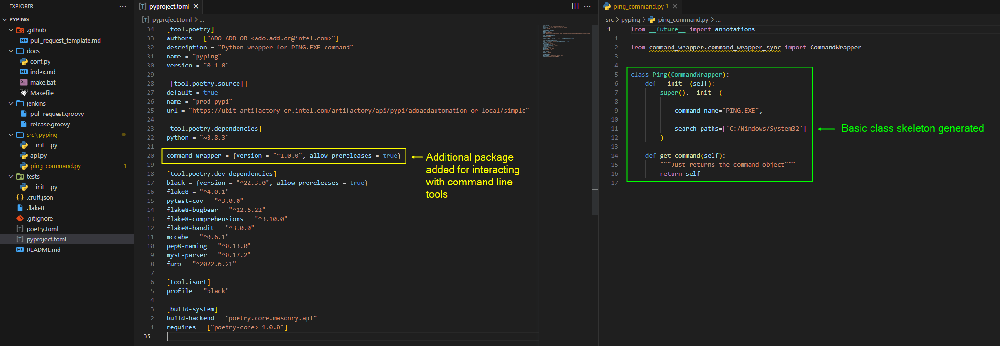

# Create package

### Install cruft and create project scaffolding

`````{tab-set}
````{tab-item} From internal PyPi

<div class="termy">

```console
$ pip install cruft --index-url https://ubit-artifactory-or.intel.com/artifactory/api/pypi/adoaddautomation-or-local/simple -U

---> 100%
```

</div>

````

````{tab-item} From external PyPi via Proxy

<div class="termy">

```console
$ pip install cruft --proxy http://proxy-dmz.intel.com:911

---> 100%
```

</div>

````
`````

---

#### Create a simple python package scafolding

`````{tab-set}
````{tab-item} cruft create

<div class="termy">

```console
$ cruft create https://github.com/intel-innersource/frameworks.validation.platform-automation.test-automation-library-template.git
# project_name [Project Name]:$ Zoom Automation
# project_slug [zoom_automation]:$ 
# project_description []:$ Python automation to verify Zoom meeting call feature
# powershell_wrapper [no]:$ 
# command_name [default_command]:$ 
# command_extension [exe]:$ 
# command_search_path [default_command_path]:$ 
# pypi_index [https://ubit-artifactory-or.intel.com/artifactory/api/pypi/adoaddautomation-or-local/simple]:$  
# python_version [~3.8.3]:$  
# use_jenkins_library_for_ci_cd [yes]:$  
# author [ADO ADD OR <ado.add.or@intel.com>]:$ 

$ code zoom-automation
```

</div>

````

````{tab-item} Project scaffolding


````
`````

---

#### Create a simple python package scafolding with [*command-wrapper*](https://github.com/intel-innersource/frameworks.validation.platform-automation.command-wrapper) dependency

`````{tab-set}
````{tab-item} cruft create

<div class="termy">

```console
$ cruft create https://github.com/intel-innersource/frameworks.validation.platform-automation.test-automation-library-template.git
# project_name [Project Name]:$ pyping
# project_slug [pyping]:$ 
# project_description []:$ Python wrapper for PING.EXE command
# powershell_wrapper [no]:$ 
# command_name [default_command]:$ PING
# command_extension [exe]:$ EXE
# command_search_path [default_command_path]:$ C:\Windows\System32
# pypi_index [https://ubit-artifactory-or.intel.com/artifactory/api/pypi/adoaddautomation-or-local/simple]:$  
# python_version [~3.8.3]:$  
# use_jenkins_library_for_ci_cd [yes]:$  
# author [ADO ADD OR <ado.add.or@intel.com>]:$ 

$ code pyping
```

</div>

````

````{tab-item} Project scaffolding



````
`````

---

#### Create a python package which wraps powershell commands

`````{tab-set}
````{tab-item} cruft create

<div class="termy">

```console
$ cruft create https://github.com/intel-innersource/frameworks.validation.platform-automation.test-automation-library-template.git
# project_name [Project Name]:$ Hyper V Automation
# project_slug [hyper_v_automation]:$ 
# project_description []:$ Python wrapper over PowerShell Hyper-V modules
# powershell_wrapper [no]:$ yes
# command_name [hyper_v_automation]:$ 
# command_extension [exe]:$ 
# command_search_path [default_command_path]:$ 
# pypi_index [https://ubit-artifactory-or.intel.com/artifactory/api/pypi/adoaddautomation-or-local/simple]:$  
# python_version [~3.8.3]:$  
# use_jenkins_library_for_ci_cd [yes]:$  
# author [ADO ADD OR <ado.add.or@intel.com>]:$ 

$ code hyper_v_automation
```

</div>

````

````{tab-item} Project scaffolding


````
`````

---

### Setting up dev environment

Once package is created you can run `poetry install` once inside the package root to install dependency.

<div class="termy">

```console
$ pip install poetry --proxy http://proxy-dmz.intel.com:911 -U
---> 100%

$ poetry install
Writing lock file

Finding the necessary packages for the current system

Package operations: 65 installs, 0 updates, 0 removals

#  • Installing certifi (2023.5.7)$ 
#  • Installing charset-normalizer (3.1.0)$ 
#  • Installing idna (3.4)$ 
#  • Installing markupsafe (2.1.2)$ 
#  • Installing pytz (2023.3)$ 
#  • Installing smmap (5.0.0)$ 
#  • Installing urllib3 (2.0.2)$ 
#  • Installing zipp (3.15.0)$ 
#  • Installing alabaster (0.7.13)$ 
#  • Installing babel (2.12.1)$ 
#  • Installing gitdb (4.0.9)$ 
#  • Installing importlib-metadata (6.6.0)$ 
#  • Installing docutils (0.17.1)$ 
#  • Installing colorama (0.4.6)$ 
#  • Installing pbr (5.9.0)$ 
#  • Installing imagesize (1.4.1)$ 
#  • Installing mccabe (0.6.1)$ 
#  • Installing mdurl (0.1.2)$ 
#  • Installing packaging (23.1)$ 
#  • Installing jinja2 (3.1.2)$ 
#  • Installing pycodestyle (2.8.0)$ 
#  • Installing pyflakes (2.4.0)$ 
#  • Installing pygments (2.15.1)$ 
#  • Installing requests (2.30.0)$ 
#  • Installing snowballstemmer (2.2.0)$ 
#  • Installing sphinxcontrib-applehelp (1.0.4)$ 
#  • Installing sphinxcontrib-devhelp (1.0.2)$ 
#  • Installing sphinxcontrib-htmlhelp (2.0.1)$ 
#  • Installing sphinxcontrib-jsmath (1.0.1)$ 
#  • Installing sphinxcontrib-qthelp (1.0.3)$ 
#  • Installing sphinxcontrib-serializinghtml (1.1.5)$ 
#  • Installing exceptiongroup (1.1.1)$ 
#  • Installing flake8 (4.0.1)$ 
#  • Installing gitpython (3.1.27)$ 
#  • Installing pluggy (1.0.0)$ 
#  • Installing iniconfig (2.0.0)$ 
#  • Installing pyyaml (6.0)$ 
#  • Installing stevedore (3.5.0)$ 
#  • Installing sphinx (4.5.0)$ 
#  • Installing markdown-it-py (2.2.0)$ 
#  • Installing tomli (2.0.1)$ 
#  • Installing soupsieve (2.3.2.post1)$ 
#  • Installing attrs (22.2.0)$ 
#  • Installing bandit (1.7.4)$ 
#  • Installing click (8.1.3)$ 
#  • Installing flake8-polyfill (1.0.2)$ 
#  • Installing mdit-py-plugins (0.3.5)$ 
#  • Installing pathspec (0.9.0)$ 
#  • Installing beautifulsoup4 (4.11.1)$ 
#  • Installing mypy-extensions (0.4.3)$ 
#  • Installing pytest (7.3.1)$ 
#  • Installing platformdirs (2.6.2)$ 
#  • Installing moreutils (0.1.1)$ 
#  • Installing coverage (7.2.5)$ 
#  • Installing sphinx-basic-ng (0.0.1a12)$ 
#  • Installing typing-extensions (4.5.0)$ 
#  • Installing black (22.6.0)$ 
#  • Installing command-wrapper (1.0.2rc1)$ 
#  • Installing flake8-comprehensions (3.10.0)$ 
#  • Installing myst-parser (0.17.2)$ 
#  • Installing pytest-cov (3.0.0)$ 
#  • Installing flake8-bugbear (22.6.22)$ 
#  • Installing flake8-bandit (3.0.0)$ 
#  • Installing furo (2022.6.21)$ 
#  • Installing pep8-naming (0.13.0)$ 

Installing the current project: pyping (0.1.0)
```

</div>

## Update existing package using cruft:

### Link package if it is not already linked
- If existing package was not link to the template (i.e. it is something which you haven't created using `cruft create`, then run `cruft link https://github.com/intel-innersource/frameworks.validation.platform-automation.test-automation-library-template.git`). After this cruft might ask you for the commit with which you want to link the current project. By default it will point to the latest commit. It's always better to point to 1st commit of the template so that once later we run `cruft update` it compare it will the lastest changes.

<details>
    <summary>Example for <i>cruft link</i></summary>

<div class="termy">

```console
$ cruft link https://github.com/intel-innersource/frameworks.validation.platform-automation.test-automation-library-template.git
# project_name [Project Name]:$ pywevtutil
# project_slug [pywevtutil]:$ 
# project_description []:$ A Python wrapper for the wevtutil command-line utility
# powershell_wrapper [no]:$ 
# command_name [default_command]:$ wevtutil
# command_extension [exe]:$ 
# command_search_path [default_command_path]:$ C:\WINDOWS\system32
Linking against the commit: 60b08a281565d0e8620250cdcfdf6659a9e2c130 which corresponds with the git reference: None
Press enter to link against this commit or provide an alternative commit.
# Link to template at commit [60b08a281565d0e8620250cdcfdf6659a9e2c130]:$ 55b9c90abbea64934663def7afc100d8006bd401
```

</div>

</details>

### Update package with the latest changes in template.
- run `cruft update` inside the package root.

<details>
    <summary>Example for <i>cruft update</i></summary>

<div class="termy">

```console
C:\Source\pywevtutil>cruft update
Respond with "s" to intentionally skip the update while marking your project as up-to-date or respond with "v" to view the changes that will be applied.
# Apply diff and update? (y, n, s, v) [y]:$ v
diff --git a/C:/Users/debakarr/AppData/Local/Temp/tmpwlhxnt7a/current_template/.flake8 b/C:/Users/debakarr/AppData/Local/Temp/tmpwlhxnt7a/new_template/.flake8
index e4eb347..7d9a566 100644
--- a/C:/Users/debakarr/AppData/Local/Temp/tmpwlhxnt7a/current_template/.flake8
+++ b/C:/Users/debakarr/AppData/Local/Temp/tmpwlhxnt7a/new_template/.flake8
@@ -1,12 +1,17 @@
 [flake8]
 min_python_version = 3.8.0
 max-line-length = 88
-extend-ignore =
-    # E501: Line too long.
-    E501
-
-    # E203: whitespace before ‘,’, ‘;’, or ‘:’
-    E203
-extend-exclude =
-    # typical name for a virtual env
-    .venv
\ No newline at end of file
+per-file-ignores = tests/*.py: S101
+exclude =
+    .git
+    __pycache__
+    setup.py
+    build
+    dist
+    releases
+    .venv
+    .tox
+    .mypy_cache
+    .pytest_cache
+    .vscode
+    .github
diff --git a/C:/Users/debakarr/AppData/Local/Temp/tmpwlhxnt7a/new_template/docs/Makefile b/C:/Users/debakarr/AppData/Local/Temp/tmpwlhxnt7a/new_template/docs/Makefile
new file mode 100644
index 0000000..d4bb2cb
--- /dev/null
+++ b/C:/Users/debakarr/AppData/Local/Temp/tmpwlhxnt7a/new_template/docs/Makefile
@@ -0,0 +1,20 @@
+# Minimal makefile for Sphinx documentation
+#
+
+# You can set these variables from the command line, and also
+# from the environment for the first two.
+SPHINXOPTS    ?=
+SPHINXBUILD   ?= sphinx-build
+SOURCEDIR     = .
+BUILDDIR      = _build
+
+# Put it first so that "make" without argument is like "make help".
+help:
+       @$(SPHINXBUILD) -M help "$(SOURCEDIR)" "$(BUILDDIR)" $(SPHINXOPTS) $(O)
+
+.PHONY: help Makefile
+
+# Catch-all target: route all unknown targets to Sphinx using the new
+# "make mode" option.  $(O) is meant as a shortcut for $(SPHINXOPTS).
+%: Makefile
+       @$(SPHINXBUILD) -M $@ "$(SOURCEDIR)" "$(BUILDDIR)" $(SPHINXOPTS) $(O)
diff --git a/C:/Users/debakarr/AppData/Local/Temp/tmpwlhxnt7a/new_template/docs/conf.py b/C:/Users/debakarr/AppData/Local/Temp/tmpwlhxnt7a/new_template/docs/conf.py
new file mode 100644
index 0000000..63a0ebf
--- /dev/null
+++ b/C:/Users/debakarr/AppData/Local/Temp/tmpwlhxnt7a/new_template/docs/conf.py
@@ -0,0 +1,68 @@
+# Configuration file for the Sphinx documentation builder.
+#
+# This file only contains a selection of the most common options. For a full
+# list see the documentation:
+# https://www.sphinx-doc.org/en/master/usage/configuration.html
+
+# -- Path setup --------------------------------------------------------------
+
+# If extensions (or modules to document with autodoc) are in another directory,
+# add these directories to sys.path here. If the directory is relative to the
+# documentation root, use os.path.abspath to make it absolute, like shown here.
+#
+# import os
+# import sys
+# sys.path.insert(0, os.path.abspath('.'))
+
+
+# -- Project information -----------------------------------------------------
+
+from datetime import date
+
+
+project = "pywevtutil"
+copyright = f"{date.today().year}, ADO ADD"
+author = 'ADO ADD'
+
+master_doc = "index"
+language = "en"
+
+# -- General configuration ---------------------------------------------------
+
+# Add any Sphinx extension module names here, as strings. They can be
+# extensions coming with Sphinx (named 'sphinx.ext.*') or your custom
+# ones.
+extensions = ["myst_parser"]
+
+# Add any paths that contain templates here, relative to this directory.
+templates_path = ['_templates']
+
+# List of patterns, relative to source directory, that match files and
+# directories to ignore when looking for source files.
+# This pattern also affects html_static_path and html_extra_path.
+exclude_patterns = ['_build', 'Thumbs.db', '.DS_Store']
+
+
+# -- Options for HTML output -------------------------------------------------
+
+# The theme to use for HTML and HTML Help pages.  See the documentation for
+# a list of builtin themes.
+#
+html_theme = 'furo'
+# html_logo = "_static/logo-wide.svg"
+# html_favicon = "_static/logo-square.svg"
+# html_title = ""
+# html_theme_options = {
+#     "home_page_in_toc": True,
+#     "github_url": "<github repo source url>",
+#     "repository_url": "<github repo source url>",
+#     "repository_branch": "main",
+#     "path_to_docs": "docs",
+#     "use_repository_button": True,
+#     "use_edit_page_button": True,
+# }
+
+# Add any paths that contain custom static files (such as style sheets) here,
+# relative to this directory. They are copied after the builtin static files,
+# so a file named "default.css" will overwrite the builtin "default.css".
+html_static_path = ['_static']
\ No newline at end of file
diff --git a/C:/Users/debakarr/AppData/Local/Temp/tmpwlhxnt7a/new_template/docs/index.md b/C:/Users/debakarr/AppData/Local/Temp/tmpwlhxnt7a/new_template/docs/index.md
new file mode 100644
index 0000000..451beda
--- /dev/null
+++ b/C:/Users/debakarr/AppData/Local/Temp/tmpwlhxnt7a/new_template/docs/index.md
@@ -0,0 +1,2 @@
+```{include} ../README.md
+```
diff --git a/C:/Users/debakarr/AppData/Local/Temp/tmpwlhxnt7a/new_template/docs/make.bat b/C:/Users/debakarr/AppData/Local/Temp/tmpwlhxnt7a/new_template/docs/make.bat
new file mode 100644
index 0000000..954237b
--- /dev/null
+++ b/C:/Users/debakarr/AppData/Local/Temp/tmpwlhxnt7a/new_template/docs/make.bat
@@ -0,0 +1,35 @@
+@ECHO OFF
+
+pushd %~dp0
+
+REM Command file for Sphinx documentation
+
+if "%SPHINXBUILD%" == "" (
+       set SPHINXBUILD=sphinx-build
+)
+set SOURCEDIR=.
+set BUILDDIR=_build
+
+%SPHINXBUILD% >NUL 2>NUL
+if errorlevel 9009 (
+       echo.
+       echo.The 'sphinx-build' command was not found. Make sure you have Sphinx
+       echo.installed, then set the SPHINXBUILD environment variable to point
+       echo.to the full path of the 'sphinx-build' executable. Alternatively you
+       echo.may add the Sphinx directory to PATH.
+       echo.
+       echo.If you don't have Sphinx installed, grab it from
+       echo.https://www.sphinx-doc.org/
+       exit /b 1
+)
+
+if "%1" == "" goto help
+
+%SPHINXBUILD% -M %1 %SOURCEDIR% %BUILDDIR% %SPHINXOPTS% %O%
+goto end
+
+:help
+%SPHINXBUILD% -M help %SOURCEDIR% %BUILDDIR% %SPHINXOPTS% %O%
+
+:end
+popd
diff --git a/C:/Users/debakarr/AppData/Local/Temp/tmpwlhxnt7a/current_template/pyproject.toml b/C:/Users/debakarr/AppData/Local/Temp/tmpwlhxnt7a/new_template/pyproject.toml
index bc80674..591df5f 100644
--- a/C:/Users/debakarr/AppData/Local/Temp/tmpwlhxnt7a/current_template/pyproject.toml
+++ b/C:/Users/debakarr/AppData/Local/Temp/tmpwlhxnt7a/new_template/pyproject.toml
@@ -10,6 +10,7 @@ name = "prod-pypi"
 url = "https://ubit-artifactory-or.intel.com/artifactory/api/pypi/adoaddautomation-or-local/simple"

 [tool.poetry.dependencies]
+python = "~3.8.3"

 command-wrapper = {version = "^1.0.0", allow-prereleases = true}

@@ -17,6 +18,16 @@ command-wrapper = {version = "^1.0.0", allow-prereleases = true}
 black = {version = "^22.3.0", allow-prereleases = true}
 flake8 = "^4.0.1"
 pytest-cov = "^3.0.0"
+flake8-bugbear = "^22.6.22"
+flake8-comprehensions = "^3.10.0"
+flake8-bandit = "^3.0.0"
+mccabe = "^0.6.1"
+pep8-naming = "^0.13.0"
+myst-parser = "^0.17.2"
+furo = "^2022.6.21"
+
+[tool.isort]
+profile = "black"

 [build-system]
 build-backend = "poetry.core.masonry.api"
Respond with "s" to intentionally skip the update while marking your project as up-to-date or respond with "v" to view the changes that will be applied.
# Apply diff and update? (y, n, s, v) [y]:$ y
error: patch failed: pyproject.toml:10
error: repository lacks the necessary blob to fall back on 3-way merge.
error: pyproject.toml: patch does not apply

Failed to apply the update. Retrying again with a different update strategy.
Checking patch .flake8...
Checking patch docs/Makefile...
Checking patch docs/conf.py...
Checking patch docs/index.md...
Checking patch docs/make.bat...
Checking patch pyproject.toml...
error: while searching for:
url = "https://ubit-artifactory-or.intel.com/artifactory/api/pypi/adoaddautomation-or-local/simple"

[tool.poetry.dependencies]

command-wrapper = {version = "^1.0.0", allow-prereleases = true}


error: patch failed: pyproject.toml:10
error: while searching for:
black = {version = "^22.3.0", allow-prereleases = true}
flake8 = "^4.0.1"
pytest-cov = "^3.0.0"

[build-system]
build-backend = "poetry.core.masonry.api"

error: patch failed: pyproject.toml:17
Applied patch .flake8 cleanly.
Applied patch docs/Makefile cleanly.
Applied patch docs/conf.py cleanly.
Applied patch docs/index.md cleanly.
Applied patch docs/make.bat cleanly.
Applying patch pyproject.toml with 2 rejects...
Rejected hunk #1.
Rejected hunk #2.

Project directory may have *.rej files reflecting merge conflicts with the update. Please resolve those conflicts manually.
Good work! Project's cruft has been updated and is as clean as possible!
```

</div>

</details>

```{note}
**Good to know**:

This templates enabld these python packages to enforce a standard coding style and standard:

- [Pytest](https://github.com/pytest-dev/pytest): Framework for unit testing.
- [Coverage](https://github.com/nedbat/coveragepy): Code coverage testing.
- [Black](https://github.com/psf/black): Automatic code formatter.
- [isort](https://github.com/PyCQA/isort): Seperate import in section and sort them.
- [bandit](https://github.com/PyCQA/bandit): Find common security issue.
- [Flake8](https://flake8.pycqa.org/en/latest/): Enforces a common style guide.
    - [flake8-bugbear](https://github.com/PyCQA/flake8-bugbear) [ ](https://github.com/PyCQA/flake8-bugbear)- Finding likely bugs and design problems in your program. flake8-bugbear - Finding likely bugs and design problems in your program.
    - [pep8-naming](https://github.com/PyCQA/pep8-naming)  - Check the PEP-8 naming conventions.
    - [flake8-isort](https://github.com/gforcada/flake8-isort)  - Wrapper around  [isort](https://github.com/PyCQA/isort) . Helps in sorting and separate imports in sections.
    - [mccabe](https://github.com/PyCQA/mccabe)  – Ned’s script to check McCabe complexity
    - [flake8-bandit](https://github.com/tylerwince/flake8-bandit)  - Wrapper around  [bandit](https://github.com/PyCQA/bandit) . For common security issues.
    - [flake8-comprehensions](https://github.com/adamchainz/flake8-comprehensions)  - Helps you write better list/set/dict comprehensions.
```