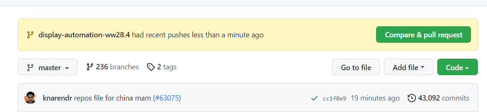

# Create repository

- Any new package repo is generally created under `frameworks.validation.platform-automation` namespace.
- Clone [inventory](https://github.com/intel-innersource/inventory): `git clone https://github.com/intel-innersource/inventory.git`
- Create a new branch. 
`git checkout -b display-automation-ww28.4`
- Edit `organizations\intel-innersource\repos\frameworks\validation\platform-automation\repos.yml` and add new repo details (mandatory fields: name, description, owners, topics, <<, branch-protection-rules, webhooks). Generally we can copy the cotent present for other repository and change the fields as per requirement.
- Push the changes and raise a pull request.

- Automatic guid will be assigned and once the pipeline pass and any one repo owner have approved the PR it will merged.
- After 5-10 mins an empty repository will be automatically created in the namespace.


```{note}
**Good to know**:

Once your pull request is approve and auto-merge is enabled, don't manually click on `Update branch` as it will reset the PR position in queue. For more details check this [stackoverflow post](https://stackoverflow.intel.com/questions/31702).
```