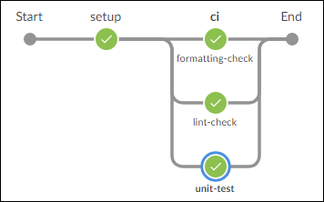

# Development process

- During the development phase developer might have to take care of multiple requirement (bug fix, new feature, enhancement etc). 
- We utilize git for versioning of the source and keeping track of changes in the source.
- We can directly use git command, UI proovided by your favourite IDE or [vc2](https://github.com/intel-innersource/frameworks.validation.platform-automation.devops.vc2).
- Process involves creating a new branch from the `main` branch.

<div class="termy">

```console
$ git checkout -b branch-name
```

</div>

OR

<div class="termy">

```console
$ vc branch branch-name
```

</div>

- Make necesaary changes in the branch (it is highly recommended to add unit test for the changes made) and then push those changes:

<div class="termy">

```console
$ git add .
$ git commit -am "Some useful commit message"
$ git push -u origin branch-name
```

</div>

OR

<div class="termy">

```console
$ vc commit "Some useful commit message"
```

</div>

- Raise a pull request (PR) either using the GitHub web UI or using `vc submit`.

<div class="termy">

```console
$ vc submit
Creating new pull request
https://github.com/intel-innersource/frameworks.validation.platform-automation.test-package/pull/8
```

</div>

- Once PR is raised a PR pipeline will automatically trigger (given it is set by following steps in [enable ci/cd](enable-cicd.md)).



```{note}
**Good to know**:

Although we don't use [tox](https://github.com/tox-dev/tox) as of now but the pull request pipeline can be locally run by running these commands:

- For linting: `flake8 src/ tests/`
- For formatting: `black --check src/ tests/`
- For unit test: `pytest --cov -vv`

In case you are getting error in formatting just run `black src/ tests/`. If you are getting error from isort, just run `isort src/ tests/`.
```

