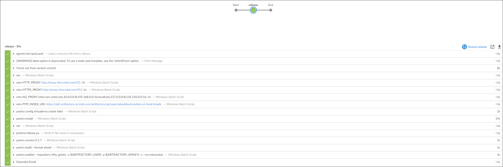

# Make release

- Release pipeline created in [Enable CI/CD](enable-cicd.md) is a [Multibranch pipeline](https://www.jenkins.io/doc/book/pipeline/multibranch/#branches-and-pull-requests) which scans for any tag with `release-*` regex. 
- If any new tag is found it will try to create a package using poetry and push it to [adoaddautomation-or-local](https://ubit-artifactory-or.intel.com/artifactory/webapp/#/artifacts/browse/tree/General/adoaddautomation-or-local) PyPi index.
- Although we can create tag manually but we recommend using [vc2](https://github.com/intel-innersource/frameworks.validation.platform-automation.devops.vc2) to apply pre-release tags and release tags.
- Very first time you need to run `vc init` command to initialize a release tag. Generally it will be `0.1.0`

<div class="termy">

```console
$ vc init 0.1.0
Init release tags with version 0.1.0
Updating local repo
# Create tag release-0.1.0-rc.1 from origin/main (commit: 493c9e6ef48fb8cdb23327d4a5b8324442dcbcd0) ? (yes/no) [no]:$ yes
Run `vc release` or `vc eval` to create more release tags.
```

</div>

- From next time onwards anytime you want to make a pre-release, just run `vc eval`. To make a stable release run `vc release`. `vc eval` accepts additional optional parameter to bump `minor`, `major` or `patch` version. For more check [Semantic Versioning](https://semver.org/).

`````{tab-set}
````{tab-item} Make pre-production release

<div class="termy">

```console
$ vc eval
Making an evaluation release in: C:\Source\zoom-automation
Updating local repo
Current version tag: release-0.1.0-rc.1 (commit: 493c9e6ef48fb8cdb23327d4a5b8324442dcbcd0)

# Create release tag release-0.1.0-rc.2 from origin/main (commit: 493c9e6ef48fb8cdb23327d4a5b8324442dcbcd0) (yes/no) [no]:$ yes
tag release-0.1.0-rc.2
Tagger: Roy, Debakar <debakar.roy@intel.com>
Date:   Fri May 12 15:57:54 2023 +0530

release-0.1.0-rc.2

commit 493c9e6ef48fb8cdb23327d4a5b8324442dcbcd0
Author: Roy, Debakar <debakar.roy@intel.com>
Date:   Fri May 12 15:55:51 2023 +0530

    initial commit
Release notes: https://github.com/intel-sandbox/zoom-automation-test/releases/release-0.1.0-rc.2
```

</div>

````

````{tab-item} Make production release

<div class="termy">

```console
$ vc release
Making a release in: C:\Source\zoom-automation
Updating local repo
Fetching reference tag from current versions.
Reference pre-release tag: release-0.1.0-rc.2 (commit: 493c9e6ef48fb8cdb23327d4a5b8324442dcbcd0)
tag release-0.1.0-rc.2
Tagger: Roy, Debakar <debakar.roy@intel.com>
Date:   Fri May 12 15:57:54 2023 +0530

release-0.1.0-rc.2

commit 493c9e6ef48fb8cdb23327d4a5b8324442dcbcd0
Author: Roy, Debakar <debakar.roy@intel.com>
Date:   Fri May 12 15:55:51 2023 +0530

    initial commit
# Create release tag release-0.1.0 from release-0.1.0-rc.2 (commit: 493c9e6ef48fb8cdb23327d4a5b8324442dcbcd0)? (yes/no) [no]:$ yes
tag release-0.1.0
Tagger: Roy, Debakar <debakar.roy@intel.com>
Date:   Fri May 12 16:00:12 2023 +0530

release-0.1.0

commit 493c9e6ef48fb8cdb23327d4a5b8324442dcbcd0
Author: Roy, Debakar <debakar.roy@intel.com>
Date:   Fri May 12 15:55:51 2023 +0530

    initial commit
Release notes: https://github.com/intel-sandbox/zoom-automation-test/releases/release-0.1.0
```

</div>

````
`````

- Once release is made a release pipeline is triggered which take care of uploading the package to specified PyPI index



```{note}
**Good to know**:

Internally `vc2` utilize [GitHub's GraphQL API](https://docs.github.com/en/graphql) for interacting with github. For versioning it utilize [python-semver](https://github.com/python-semver/python-semver) package.
```